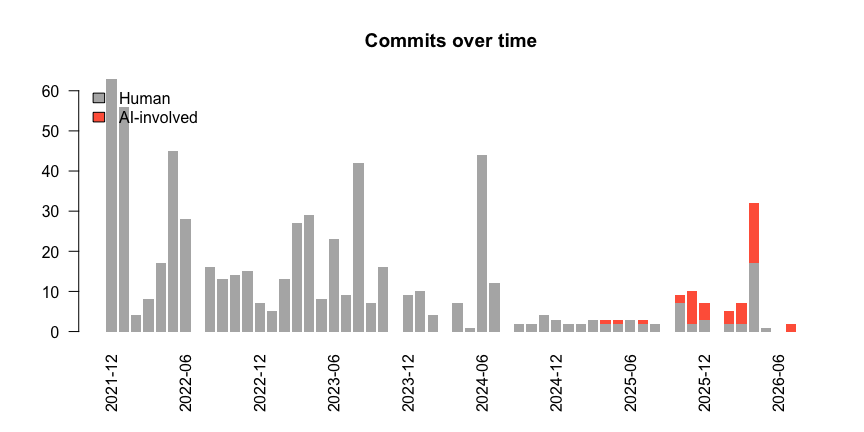
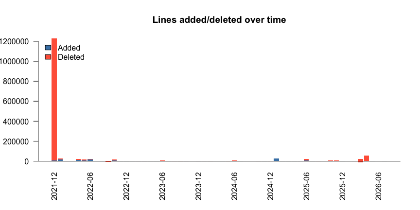

<!-- README.md is generated from README.qmd. Please edit that file. -->

# aitracking: Measure the effects of AI coding using the GitHub API

<!-- badges: start -->

[](https://github.com/gvegayon/aitracking/actions/workflows/R-CMD-check.yaml)
[](https://app.codecov.io/gh/gvegayon/aitracking)
<!-- badges: end -->

`aitracking` is a lightweight R pipeline to measure the effects of
AI-assisted coding on software projects using the GitHub REST API. It
retrieves commit histories (with lines added/deleted), issue and pull
request conversations, download/clone statistics, and the evolution of a
project’s size; classifies which of those events involved an AI coding
agent; and visualizes the result.

Design goals:

- **Minimal dependencies.** The GitHub API client is written with base R
  connections; the only hard dependencies are `data.table` and
  `jsonlite`.
- **Pipe-friendly.** Every function takes data as its first argument and
  returns a `data.table`, so steps compose with R’s native pipe `|>`.
- **Parsimonious AI detection.** A small, transparent set of rules
  (author/committer identities, `Co-authored-by:`/`Generated with`
  trailers, and `@`-mentions) flags AI involvement. Extend it with your
  own patterns.

## Installation

``` r
# install.packages("remotes")
remotes::install_github("gvegayon/aitracking")
```

## Authentication

Functions look for a GitHub token via `gh_token()`: an explicit `token`
argument, the `GITHUB_PAT`/`GITHUB_TOKEN` environment variables, or the
git credential store (if the `gitcreds` package is installed).
Unauthenticated requests work but are rate-limited to 60 calls/hour
(5,000/hour with a token).

## Example

Retrieve a commit history, add per-commit line counts, tag AI
involvement, and plot it:

``` r
library(aitracking)

commits <- gh_commits("UofUEpiBio/epiworld") |> # the full commit history...
  gh_commit_lines() |>                          # ...+ lines added/deleted
  ai_classify()                                 # ...+ AI involvement flags
```

The package ships a snapshot of the commit history of the
[UofUEpiBio/epiworld](https://github.com/UofUEpiBio/epiworld) C++
library, so the above can be reproduced offline:

``` r
library(aitracking)

data(epiworld_commits)

commits <- ai_classify(epiworld_commits)
commits[, .(sha = substr(sha, 1, 7), author, date, ai, ai_agent)] |>
  tail()
```

           sha   author                date     ai ai_agent
        <char>   <char>              <POSc> <lgcl>   <char>
    1: 8a992b6 gvegayon 2026-04-29 03:56:48  FALSE     <NA>
    2: 95344d3 gvegayon 2026-04-29 07:28:32  FALSE     <NA>
    3: 68f9f34 gvegayon 2026-04-29 07:54:12  FALSE     <NA>
    4: c966f02 gvegayon 2026-05-11 05:43:58  FALSE     <NA>
    5: 1c1cf02  Copilot 2026-07-17 05:27:19   TRUE  copilot
    6: b11c350 gvegayon 2026-07-31 15:32:19   TRUE  copilot

``` r
plot_timeline(commits, by = "commits")
```



``` r
plot_timeline(commits, by = "lines")
```



See the package vignette
([`vignette("epiworld")`](https://gvegayon.github.io/aitracking/articles/epiworld.html))
for a complete walk-through: when AI became involved in epiworld, and
how commit and coding activity changed since.

## Main functions

| Function | Description |
|----|----|
| `gh_commits()` | Commit history (author, hash, message, time) of one or more repos |
| `gh_commit_lines()` | Lines added/deleted per commit (optionally per file) |
| `gh_interactions()` | Issues, PRs, and comments–including human requests to AI agents |
| `gh_traffic()` | Clone/view history (last 14 days, requires push access) |
| `gh_downloads()` | All-time download counts of release assets |
| `gh_languages()` | Current language composition of a repo |
| `ai_classify()` | Tag rows where an AI agent was involved (or mentioned) |
| `loc_evolution()` | Evolution of project size (net lines of code, by language) |
| `plot_timeline()` | Activity timeline by commits or by lines added/deleted |
| `gh_api()` / `gh_token()` | Low-level API access and token discovery |

## Related work

If you need a full-featured GitHub API client, see the
[gh](https://gh.r-lib.org/) package. `aitracking` deliberately
implements its own minimal client to keep the dependency footprint
small.
