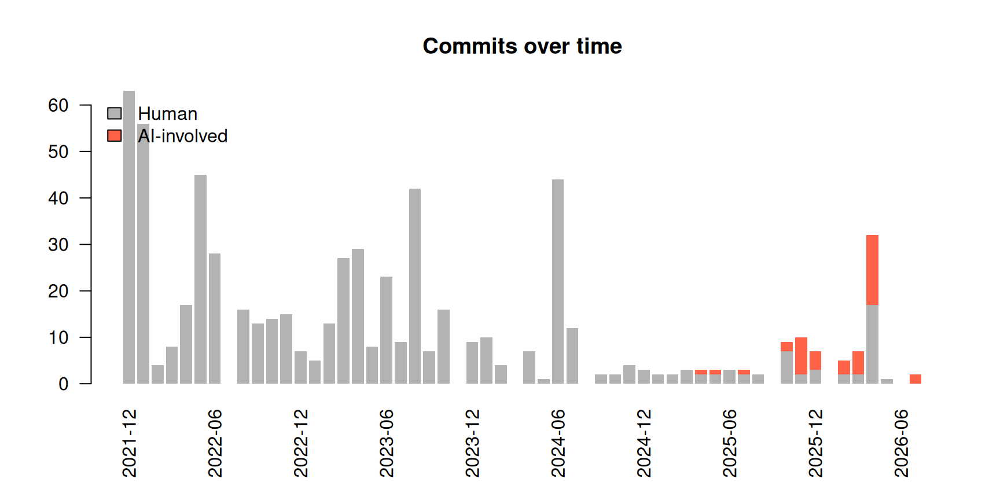
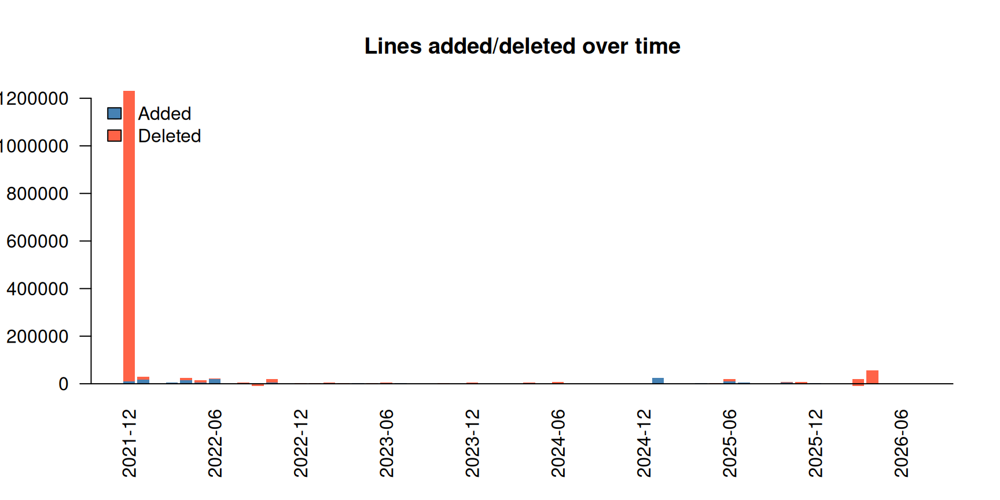
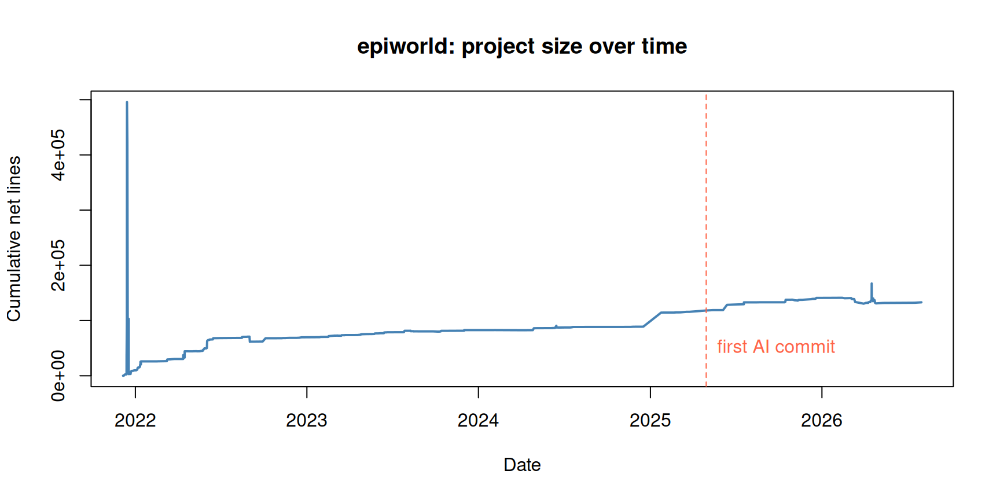

# Measuring AI involvement in a repository: the epiworld case

This vignette walks through a complete analysis of AI involvement in a
real project: [epiworld](https://github.com/UofUEpiBio/epiworld), a C++
header-only library for agent-based epidemiological simulations
developed at the University of Utah. We will answer three questions:

1.  **When** did AI coding agents become involved in the project?
2.  **How much** of the commit and coding activity involves AI?
3.  **How** did activity change after AI became involved?

``` r

library(aitracking)
library(data.table)
#> 
#> Attaching package: 'data.table'
#> The following object is masked from 'package:base':
#> 
#>     %notin%
```

## Getting the data

Two calls retrieve everything we need.
[`gh_commits()`](https://gvegayon.github.io/aitracking/reference/gh_commits.md)
downloads the full commit history,
[`gh_commit_lines()`](https://gvegayon.github.io/aitracking/reference/gh_commit_lines.md)
adds per-commit line counts (one API call per commit), and
[`gh_interactions()`](https://gvegayon.github.io/aitracking/reference/gh_interactions.md)
downloads the issue/PR conversation layer–which survives even when PRs
are squash-merged:

``` r

commits <- gh_commits("UofUEpiBio/epiworld") |>
  gh_commit_lines()

interactions <- gh_interactions("UofUEpiBio/epiworld")
```

Both functions authenticate via
[`gh_token()`](https://gvegayon.github.io/aitracking/reference/gh_token.md)
(an explicit token, the `GITHUB_PAT`/`GITHUB_TOKEN` environment
variables, or the git credential store). So that this vignette builds
offline, the package ships a snapshot of both datasets taken on
2026-07-31, and we use it from here on:

``` r

data(epiworld_commits)
data(epiworld_interactions)

commits      <- epiworld_commits
interactions <- epiworld_interactions

commits[, .(sha = substr(sha, 1, 7), author, date, additions, deletions)] |>
  head()
#>        sha   author                date additions deletions
#>     <char>   <char>              <POSc>     <int>     <int>
#> 1: 0d00ddd gvegayon 2021-12-05 19:18:35        61         0
#> 2: 056ba29 gvegayon 2021-12-05 19:20:32        23        23
#> 3: ad76492 gvegayon 2021-12-06 05:08:14        40        12
#> 4: ec0b26f gvegayon 2021-12-06 23:09:15        68        70
#> 5: fe50b2e gvegayon 2021-12-07 21:27:42       451         0
#> 6: 6782eef gvegayon 2021-12-07 22:02:09        58         9
```

## When did AI become involved?

[`ai_classify()`](https://gvegayon.github.io/aitracking/reference/ai_classify.md)
tags each commit using a small set of transparent rules: AI identities
among authors/committers (e.g., `copilot[bot]`), and attribution
trailers in the commit message (e.g., `Co-authored-by: Claude`). The
default patterns are in
[`ai_patterns()`](https://gvegayon.github.io/aitracking/reference/ai_patterns.md);
the generic `bot` pattern also catches non-AI automation such as
Dependabot, so we drop it here to focus on actual AI coding agents:

``` r

ai_only <- ai_patterns()[names(ai_patterns()) != "bot"]

commits <- ai_classify(commits, patterns = ai_only)

# How many commits involved AI, and which agents?
commits[, .N, by = .(ai, ai_agent)]
#>        ai ai_agent     N
#>    <lgcl>   <char> <int>
#> 1:  FALSE     <NA>   615
#> 2:   TRUE  copilot    42
```

``` r

first_ai <- commits[ai == TRUE, min(date)]
first_ai
#> [1] "2025-04-29 16:42:11 UTC"
```

So the first AI-involved commit happened on April 29, 2025:

``` r

commits[ai == TRUE][which.min(date), .(
  sha = substr(sha, 1, 7), author, date,
  message = substr(message, 1, 60), ai_agent
)]
#>        sha   author                date
#>     <char>   <char>              <POSc>
#> 1: 07e6239 gvegayon 2025-04-29 16:42:11
#>                                                         message ai_agent
#>                                                          <char>   <char>
#> 1: Updates to the mixing model and the measles model (+tests) (  copilot
```

## Visualizing the timeline

[`plot_timeline()`](https://gvegayon.github.io/aitracking/reference/plot_timeline.md)
shows monthly activity. Since the data went through
[`ai_classify()`](https://gvegayon.github.io/aitracking/reference/ai_classify.md),
commit bars are split into human and AI-involved:

``` r

plot_timeline(commits, by = "commits")
```



The same timeline in terms of lines added and deleted:

``` r

plot_timeline(commits, by = "lines")
```



## How did activity change since AI got involved?

A simple before/after comparison of monthly activity:

``` r

commits[, period := fifelse(date < first_ai, "1. Before AI", "2. Since AI")]

stats <- commits[, .(
  months        = uniqueN(format(date, "%Y-%m")),
  commits       = .N,
  authors       = uniqueN(author_name),
  lines_added   = sum(additions, na.rm = TRUE),
  lines_deleted = sum(deletions, na.rm = TRUE)
), by = period]

stats[, `:=`(
  commits_month = round(commits / months, 1),
  added_month   = round(lines_added / months, 1),
  deleted_month = round(lines_deleted / months, 1)
)]

stats
#>          period months commits authors lines_added lines_deleted commits_month
#>          <char>  <int>   <int>   <int>       <int>         <int>         <num>
#> 1: 1. Before AI     37     572       6     1425432       1308001          15.5
#> 2:  2. Since AI     13      85       5      125944        110369           6.5
#>    added_month deleted_month
#>          <num>         <num>
#> 1:     38525.2       35351.4
#> 2:      9688.0        8489.9
```

And within the AI period, how much of the work is AI-involved?

``` r

commits[period == "2. Since AI", .(
  commits     = .N,
  lines_added = sum(additions, na.rm = TRUE)
), by = ai]
#>        ai commits lines_added
#>    <lgcl>   <int>       <int>
#> 1:   TRUE      42       83724
#> 2:  FALSE      43       42220
```

## Human requests to AI: the conversation layer

Commit histories under-count AI involvement: when a PR authored by an
agent is squash-merged, the merge commit may carry a human identity. The
issue/PR conversation retrieved by
[`gh_interactions()`](https://gvegayon.github.io/aitracking/reference/gh_interactions.md)
preserves that history.
[`ai_classify()`](https://gvegayon.github.io/aitracking/reference/ai_classify.md)
adds two flags here: `ai` (the comment/issue was authored by an AI
agent) and `ai_mention` (the text addresses or mentions an agent–a proxy
for humans prompting AI):

``` r

interactions <- ai_classify(interactions, patterns = ai_only)

# Overall activity by type
interactions[, .N, by = type]
#>              type     N
#>            <char> <int>
#> 1:   pull_request   154
#> 2:          issue    99
#> 3:  issue_comment   534
#> 4: review_comment   502

# Comments/issues authored by AI agents
interactions[ai == TRUE, .N, by = ai_agent]
#>    ai_agent     N
#>      <char> <int>
#> 1:  copilot   413
#> 2:   claude     1

# Humans prompting/addressing AI agents
interactions[ai == FALSE & !is.na(ai_mention), .N, by = ai_mention]
#>    ai_mention     N
#>        <char> <int>
#> 1:    copilot    60
```

Activity by user (top 10), distinguishing AI agents from humans:

``` r

interactions[, .N, by = .(user, ai)][order(-N)] |> head(10)
#>                   user     ai     N
#>                 <char> <lgcl> <int>
#> 1:             Copilot   TRUE   413
#> 2:            gvegayon  FALSE   373
#> 3:        olivia-banks  FALSE   253
#> 4:        codecov[bot]  FALSE   113
#> 5: github-actions[bot]  FALSE    75
#> 6:          apulsipher  FALSE    61
#> 7:            gvegayon   TRUE     1
```

## Evolution of the project’s size

[`loc_evolution()`](https://gvegayon.github.io/aitracking/reference/loc_evolution.md)
accumulates net lines changed (additions minus deletions) over time–an
approximation of the project’s size in lines:

``` r

lo <- loc_evolution(commits)

plot(
  lo$date, lo$loc, type = "l", lwd = 2, col = "steelblue",
  xlab = "Date", ylab = "Cumulative net lines",
  main = "epiworld: project size over time"
)
abline(v = as.numeric(first_ai), lty = 2, col = "tomato")
text(
  as.numeric(first_ai), max(lo$loc) * 0.1, "first AI commit",
  pos = 4, col = "tomato"
)
```



For a by-language breakdown, retrieve file-level detail with
`gh_commit_lines(commits, files = TRUE)` and pass that to
[`loc_evolution()`](https://gvegayon.github.io/aitracking/reference/loc_evolution.md),
or get the current snapshot with:

``` r

gh_languages("UofUEpiBio/epiworld")
```

## Caveats

- [`ai_classify()`](https://gvegayon.github.io/aitracking/reference/ai_classify.md)
  is deliberately parsimonious: it only catches AI involvement that is
  *visible* (bot identities, attribution trailers, mentions).
  Undisclosed AI assistance–e.g., code written with editor completions
  and committed under a human identity–is not detectable from API
  metadata alone, so these figures are lower bounds.
- Net lines changed is a rough proxy for project size; it includes
  documentation and data files unless filtered out (use the file-level
  output of
  [`gh_commit_lines()`](https://gvegayon.github.io/aitracking/reference/gh_commit_lines.md)
  to do so).
- [`gh_traffic()`](https://gvegayon.github.io/aitracking/reference/gh_traffic.md)
  (clones/views) only covers the last 14 days and requires push access,
  so building a long download history requires periodic snapshots.
